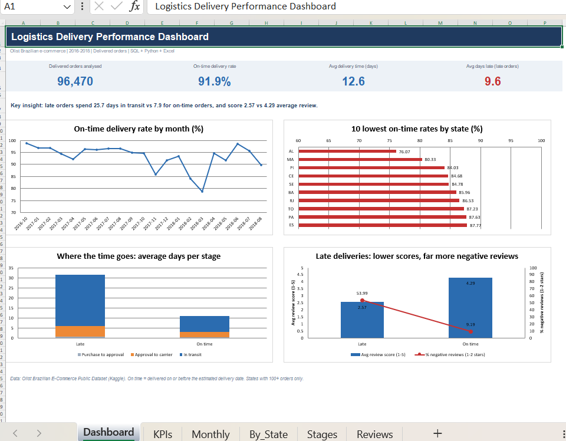
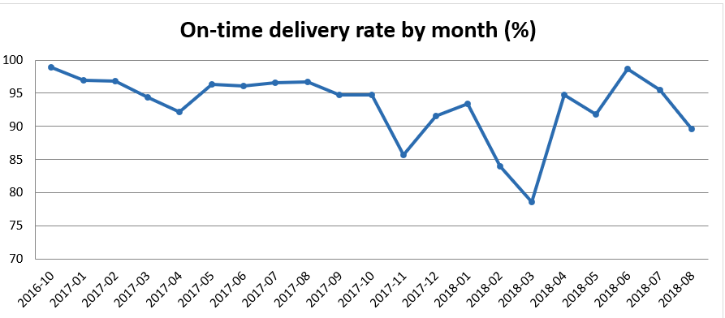
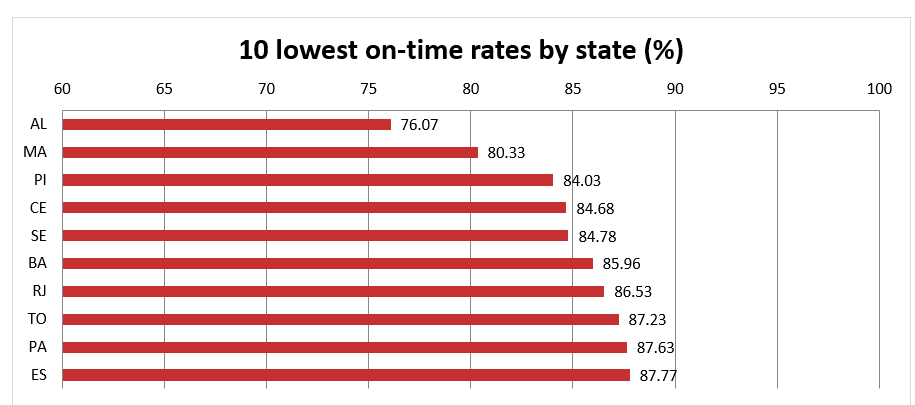
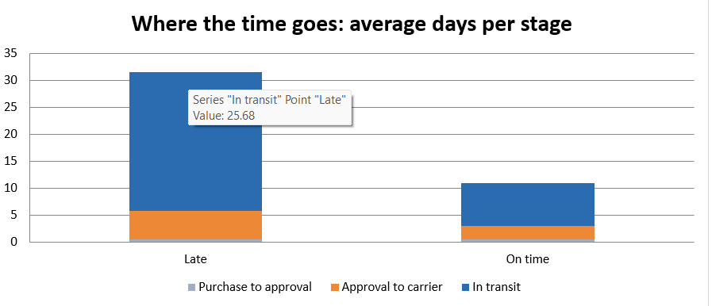
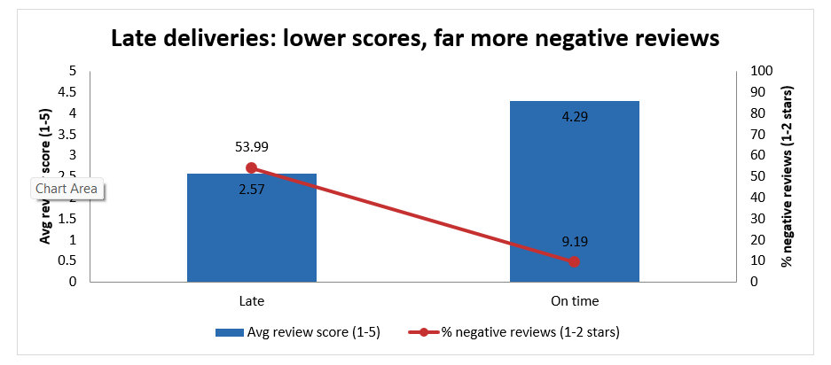
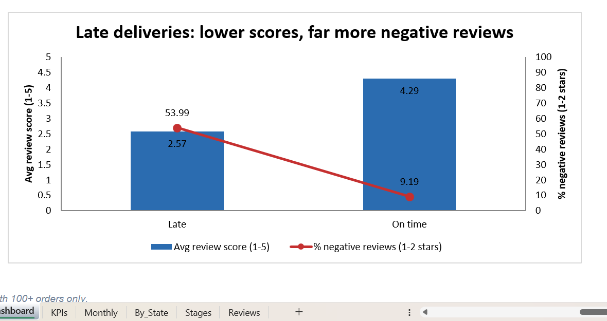

Logistics Delivery Performance Analysis
Tools: SQL (SQLite) · Python (pandas, matplotlib) · Excel
Business question: Where and why do e-commerce orders arrive late, and how much does late delivery hurt customer satisfaction?
Dashboard

The Excel dashboard is in `dashboard/Logistics_Delivery_Dashboard.xlsx`.
Dataset
Olist Brazilian E-Commerce Public Dataset (Kaggle): about 100K orders from 2016 to 2018. Files used: `olist_orders_dataset.csv`, `olist_customers_dataset.csv`, `olist_order_reviews_dataset.csv`. Analysis covers 96,470 delivered orders that have a delivery date.
Definition: an order is on time if it was delivered on or before the estimated delivery date.
Method
Loaded the CSVs into SQLite and wrote five SQL queries (in `sql/`) using joins, a CTE, conditional aggregation and date functions.
Calculated on-time rate and delivery time overall, by month and by state (states with 100+ orders).
Split delivery time into three stages (purchase to approval, approval to carrier, in transit) for on-time vs late orders.
Compared customer review scores for on-time vs late orders.
Built an Excel dashboard from the query results.
SQL queries
File	What it answers
`01_overall_kpis.sql`	Overall on-time rate, average delivery days, average days late
`02_monthly_trend.sql`	On-time rate by month
`03_by_state.sql`	On-time rate and delivery time by state
`04_stage_breakdown.sql`	Where the time goes: approval, carrier handover, transit
`05_review_impact.sql`	Review scores for on-time vs late orders
Key findings
91.9% of 96,470 delivered orders arrived on time; average delivery took 12.6 days.
Late orders arrived on average 9.6 days after the estimated date.
The delay happens in transit. Late orders spent about 25.7 days in transit vs 7.9 for on-time orders. They also waited longer for carrier handover (5.3 vs 2.6 days). Approval time was almost the same (0.5 vs 0.4 days).
Regional gap: the lowest on-time rates were in AL (76.1%), MA (80.3%), PI (84.0%), CE (84.7%) and SE (84.8%), all in northeastern Brazil.
Seasonal dips: on-time rate fell to 85.7% in Nov 2017 and to 78.6% in Mar 2018, while most other months were above 91%.
Reviews: late orders average 2.57 stars vs 4.29 for on-time orders. 54.0% of late orders got a 1-2 star review vs 9.2% of on-time orders.
Fast is not the same as on time. AM averages 26.4 days to deliver but is 95.9% on time, because estimates for remote states are set generously. So the on-time rate depends on how the estimate is set, not only on speed.
Charts
On-time delivery rate by month

10 lowest on-time rates by state

Where the time goes: average days per stage

Late deliveries: lower scores, far more negative reviews

Review score vs delivery outcome

Recommendations
These follow from the findings above and are suggestions, not tested interventions.
Target the transit leg in the northeast. Transit is the largest gap between late and on-time orders, and the weakest states are clustered in one region. Review carrier performance and routes there first.
Shorten carrier handover time. Late orders wait twice as long to reach the carrier (5.3 vs 2.6 days). Monitoring seller dispatch time is a cheaper lever than changing the transit network.
Warn customers early about at-risk orders. More than half of late orders get a 1-2 star review. Proactive delay notices may reduce the damage.
Prepare for peak periods. The sharpest drops (Nov 2017, Feb-Mar 2018) suggest capacity planning ahead of busy seasons.
Limitations
Only delivered orders with a delivery date are included; cancelled and in-progress orders are excluded.
Reviews are available for most but not all orders (about 770 orders in the dataset have none), and some orders have more than one review, which the query averages.
The link between late delivery and low reviews is an association. Other factors, such as product quality, also affect review scores.
Repository structure
```
logistics-delivery-analysis/
├── sql/             the five SQL queries
├── python/          analysis.py (runs the queries, saves charts and exports)
│                    make_sample_data.py (simulated data to test the pipeline only)
├── data/            CSV exports of the query results
├── images/          charts and dashboard screenshots used in this README
├── dashboard/       Excel dashboard (KPI cards + 4 charts)
├── requirements.txt Python packages needed
└── README.md
```
How to run
```bash
pip install -r requirements.txt
# download the 3 CSV files from Kaggle and place them where analysis.py expects them, then:
python python/analysis.py
```
`make_sample_data.py` generates simulated data for testing only and does not produce real results.
